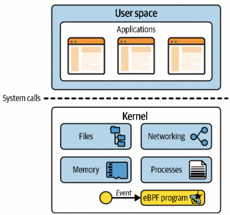

# EBPF 介绍-01
## 什么是EBPF
eBPF 全称为 Extended Berkeley Packet Filter，源于 BPF（Berkeley Packet Filter）, 从其命名可以看出来，它适用于网络报文过滤的功能模块。但是，eBPF已经进化为一个通用的执行引擎，其本质为内核中一个类似于虚拟机的功能模块。eBPF 允许开发者编写在内核中运行的自定义代码，并动态加载到内核，附加到某个触发 eBPF 程序执行的内核事件上，而不再需要重新编译新的内核模块，可以根据需要动态加载和卸载 eBPF 程序。由此开发者可以基于 eBPF 开发各种网络、可观察性以及安全方面的工具。我们所熟知的 tcpdump、Wireshark、strace、perf 等工具，都是基于 BPF 技术实现的。

BPF 提供了一种在内核事件和用户程序事件发生时安全注入代码的机制，这就让非内核开发人员也可以对内核进行控制。随着内核的发展，BPF 逐步从最初的数据包过滤扩展到了网络、内核、安全、跟踪等，而且它的功能特性还在快速发展中，这种扩展后的 BPF 被简称为 eBPF（相应的，早期的 BPF 被称为经典 BPF，简称 cBPF）。实际上，现代内核所运行的都是 eBPF，如果没有特殊说明，内核和开源社区中提到的 BPF 等同于 eBPF。

在 eBPF 之前，内核模块是注入内核的最主要机制。由于缺乏对内核模块的安全控制，内核的基本功能很容易被一个有缺陷的内核模块破坏。而 eBPF 则借助即时编译器（JIT），在内核中运行了一个虚拟机，保证只有被验证安全的 eBPF 指令才会被内核执行。同时，因为 eBPF 指令依然运行在内核中，无需向用户态复制数据，这就大大提高了事件处理的效率。

正是由于这些突出的特性，eBPF 现如今已经在故障诊断、网络优化、安全控制、性能监控等领域获得大量应用。比如，Facebook 开源的高性能网络负载均衡器 Katran、Isovalent 开源的容器网络方案 Cilium ，以及著名的内核跟踪排错工具 BCC 和 bpftrace 等，都是基于 eBPF 技术实现的。


## eBPF用途
eBPF 是一种非常灵活和强大的内核技术，可以用于多种应用场景。下面是 eBPF 的一些常见用途
- 网络监控：eBPF 可以用于捕获网络数据包，并执行特定的逻辑来分析网络流量。例如，可以使用 eBPF 程序来监控网络流量，并在发现异常流量时进行警报。
- 安全过滤：eBPF 可以用于对网络数据包进行安全过滤。例如，可以使用 eBPF 程序来阻止恶意流量的传播，或者在发现恶意流量时对其进行拦截。
- 性能分析：eBPF 可以用于对内核的性能进行分析。例如，可以使用 eBPF 程序来收集内核的性能指标，并通过特定的接口将其可视化。这样，可以更好地了解内核的性能瓶颈，并进行优化。
- 虚拟化：eBPF 可以用于虚拟化技术。例如，可以使用 eBPF 程序来收集虚拟机的性能指标，并进行负载均衡。这样，可以更好地利用虚拟化环境的资源，提高系统的性能和稳定性。
  
总之，eBPF 的常见用途非常广泛，可以用于网络监控、安全过滤、性能分析和虚拟化等多种应用场景。
## eBPF 的发展历程
早在 1992 年的 USENIX 会议上，Steven McCanne 和 Van Jacobson 发布的论文“The BSD Packet Filter: A New Architecture for User-level Packet Capture” 就为 BSD 操作系统带来了革命性的包过滤机制 BSD Packet Filter（简称为 BPF），这比当时最先进的数据包过滤技术还快 20 倍。为什么性能这么好呢？这主要得益于 BPF 的两大设计：
- 第一，内核态引入一个新的虚拟机，所有指令都在内核虚拟机中运行。
- 第二，用户态使用 BPF 字节码来定义过滤表达式，然后传递给内核，由内核虚拟机解释执行。
  
这就使得包过滤可以直接在内核中执行，避免了向用户态复制每个数据包，从而极大提升了包过滤的性能，进而被各大操作系统广泛接受。BPF 最初的名字 BSD Packet Filter ，也被作者的工作单位名所替代，变成了 Berkeley Packet Filter（很巧的是，还是简称 BPF）。

在 BPF 诞生五年后，Linux 2.1.75 首次引入了 BPF 技术，随后  BPF 开始了不温不火的发展历程。其中，Linux 3.0 中增加的 BPF 即时编译器可以算是一个最重大的更新了。它替换掉了原本性能更差的解释器，进一步优化了 BPF 指令运行的效率。但直到此时，BPF 的应用还是仅限于网络包过滤这个传统的领域中。

从 2014 年内核版本 3.18 开始，BPF 演变为我们所说的“扩展 BPF”或“eBPF”。这涉及到几个重大变化：
- BPF 指令集经过彻底修改，在 64 位机器上更加高效，并且解释器也被完全重写。
- 引入了eBPF 映射，它是可由BPF 程序和用户空间应用程序访问的数据结构，允许它们之间共享信息。
- 添加了bpf()系统调用，它允许用户空间应用程序加载和执行eBPF 程序。
- 添加了多个BPF 辅助函数。
- 添加了eBPF 验证器以确保eBPF 程序可以安全运行。

**eBPF 的诞生是 BPF 技术的一个转折点，使得 BPF 不再仅限于网络栈，而是成为内核的一个顶级子系统。**

在内核发展的同时，eBPF 繁荣的生态也进一步促进了 eBPF 的蓬勃发展。这其中，最典型的就是 iovisor 带来的 BCC、bpftrace 等工具，成为 eBPF 在跟踪和排错领域的最佳实践。由于 eBPF 无需修改内核源码和重新编译内核就可以扩展内核的功能，Cilium、Katran、Falco 等一系列基于 eBPF 优化网络和安全的开源项目也逐步诞生。并且，越来越多的开源和商业解决方案开始借助 eBPF，优化其网络、安全以及观测的性能。比如，最流行的网络解决方案之一 Calico，就在最近的版本中引入了 eBPF 数据面网络，大大提升了网络的性能。


直到今天，eBPF 依然是内核社区最活跃的子模块之一，还处在一个快速发展的过程中。可以说，eBPF 开启的创新才刚刚开始，在未来我们会看到更多的创新案例。
## EBPF如何工作的
### Linux 内核
要理解 eBPF，您需要充分掌握 Linux 中内核空间和用户空间之间的区别。Linux 内核是应用程序和它们运行的​​硬件之间的软件层。应用程序运行在称为用户空间的非特权层中，该层无法直接访问硬件。相反，应用程序使用系统调用（syscall）接口发出请求，请求内核代表其执行操作。硬件访问可能涉及读取和写入文件、发送或接收网络流量，甚至只是访问内存。内核还负责协调并发进程，使许多应用程序能够同时运行。


作为应用程序开发人员，我们通常不直接使用系统调用接口，因为编程语言为我们提供了高级抽象和标准库，这些接口更容易编程。结果，很多人不知道我们的程序运行时内核做了多少事情。如果您想了解调用内核的频率，可以使用 strace 工具。例如，以下命令将显示在运行 ```echo hello``` 命令时调用内核的系统调用：
``` shell
 strace -c echo hello
hello
% time     seconds  usecs/call     calls    errors syscall
------ ----------- ----------- --------- --------- ----------------
 32.15    0.000372          12        30        12 openat
 31.72    0.000367          18        20           close
 16.42    0.000190          10        19           newfstatat
 15.13    0.000175           8        20           mmap
  2.51    0.000029          29         1           write
  1.21    0.000014           4         3           read
  0.86    0.000010          10         1           futex
  0.00    0.000000           0         1         1 faccessat
  0.00    0.000000           0         1           set_tid_address
  0.00    0.000000           0         1           set_robust_list
  0.00    0.000000           0         3           brk
  0.00    0.000000           0         3           munmap
  0.00    0.000000           0         1           execve
  0.00    0.000000           0         4           mprotect
  0.00    0.000000           0         1           prlimit64
  0.00    0.000000           0         1           getrandom
  0.00    0.000000           0         1           rseq
------ ----------- ----------- --------- --------- ----------------
100.00    0.001157          10       111        13 total
```
由于应用程序严重依赖于内核，这意味着如果我们可以观察应用程序与内核的交互，来了解有关应用程序行为的信息。通过 eBPF，我们可以将工具添加到内核中来观察和修改应用程序的行为，而无需修改应用程序本身。

例如，如果您能够拦截用于打开文件的系统调用，您就可以准确地看到任何应用程序访问了哪些文件。但是要怎么去拦截呢？有三种方案：
- 修改内核源代码并重新编译内核：这是最原始的方法，Linux 内核非常复杂，在撰写本文时约有 3000 万行代码。对任何代码库进行更改都需要熟悉现有代码，因此除非您已经是内核开发人员，否则这可能会带来挑战。并且需要您重新编译内核，这可能需要很长时间。即时你的代码已经进了内核，它仍然需要很长时间才能在大多数人的生产环境中可用。
- 内核模块：如果您不想等待数年才能将更改纳入内核，那么还有另一种选择。 Linux 内核被设计为接受内核模块，这些模块可以按需加载和卸载。如果您想更改或扩展内核行为，编写模块无疑是一种方法。内核模块可以独立于官方 Linux 内核版本分发给其他人使用，因此不必被主要上游代码库接受。这里最大的挑战是这仍然是完整的内核编程。历史上，用户对于使用内核模块一直非常谨慎，原因很简单：如果内核代码崩溃，就会导致机器及其上运行的所有内容崩溃。用户如何确信内核模块可以安全运行.“安全运行”不仅仅意味着不崩溃——用户想知道内核模块从安全角度来看是安全的。它是否包含攻击者可以利用的漏洞、该模块的作者不会在其中添加恶意代码 等等。这些问题使得内核模块的使用非常受限制。
- 动态加载EBPF
eBPF 程序可以动态地加载到内核中或从内核中删除。一旦它们插桩到某个事件，它们就会被该事件触发.例如，如果您将一个程序插桩到用于打开文件的系统调用，则每当任何进程尝试打开文件时都会触发该程序。加载程序时该进程是否已经在运行并不重要。与升级内核然后必须重新启动计算机才能使用其新功能相比，这是一个巨大的优势。人们可以通过 eBPF 非常快速地创建新的内核功能，而不需要所有其他 Linux 用户接受相同的更改。


### eBPF工作原理
eBPF 程序并不像常规的线程那样，启动后就一直运行在那里，它需要事件触发后才会执行。这些事件包括系统调用、内核跟踪点、内核函数和用户态函数的调用退出、网络事件，等等。借助于强大的内核态插桩（kprobe）和用户态插桩（uprobe），eBPF 程序几乎可以在内核和应用的任意位置进行插桩。

看到这个令人惊叹的能力，你一定有疑问：这会不会像内核模块一样，一个异常的 eBPF 程序就会损坏整个内核的稳定性呢？其实，确保安全和稳定一直都是 eBPF 的首要任务，不安全的 eBPF 程序根本就不会提交到内核虚拟机中执行。

Linux 内核是如何实现 eBPF 程序的安全和稳定的呢？其实很简单，我带你看个 eBPF 程序的执行过程，你就明白了。

如下图所示
- 通常我们借助 LLVM 把编写的 eBPF 程序转换为 BPF 字节码
- 然后使用加载程序Loader通过 bpf() 系统调用提交给内核
- 内核在接受 BPF 字节码之前，会首先通过验证器对字节码进行校验，只有校验通过的 BPF 字节码才会提交到即时编译器执行。比如，下面就是一些典型的验证过程：
  - 只有特权进程才可以执行 bpf 系统调用；
  - BPF 程序不能包含无限循环；
  - BPF 程序不能导致内核崩溃；
  - BPF 程序必须在有限时间内完成。
- 验证完成之后，经过即时编译器编译(JIT)后的 BPF 机器码(CPU可以是别的0101xx)交给内核执行。


## BPF 映射
BPF 程序可以利用 BPF 映射（map）进行存储，而用户程序通常也需要通过 BPF 映射同运行在内核中的 BPF 程序进行交互。如下图所示，在性能观测中，BPF 程序收集内核运行状态存储在映射中，用户程序再从映射中读出这些状态。

可以看到，eBPF 程序的运行需要历经编译、加载、验证和内核态执行等过程，而用户态程序则需要借助 BPF 映射来获取内核态 eBPF 程序的运行状态。
## ebpf的限制
eBPF 并不是万能的，它也有很多的局限性。下面是一些最常见的  eBPF 限制：
- eBPF 程序必须被验证器校验通过后才能执行，且不能包含无法到达的指令；
- eBPF 程序不能随意调用内核函数，只能调用在 API 中定义的辅助函数；
- eBPF 程序栈空间最多只有 512 字节，想要更大的存储，就必须要借助映射存储；
- 在内核 5.2 之前，eBPF 字节码最多只支持 4096 条指令，而 5.2 内核把这个限制提高到了 100 万条；
  
由于内核的快速变化，在不同版本内核中运行时，需要访问内核数据结构的 eBPF 程序很可能需要调整源码，并重新编译。此外，虽然 Linux 内核很早就已经支持了 eBPF，但很多新特性都是在 4.x 版本中逐步增加的，具体你可以看下这个链接。所以，想要稳定运行 eBPF 程序，内核版本至少需要 4.9 或者更新。而在开发和学习 eBPF 时，为了体验最新的 eBPF 特性，我推荐使用更新的 5.x 内核。
