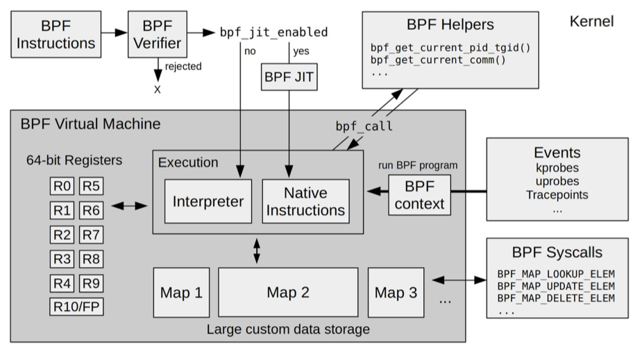

# EBPF 介绍-01
## 什么是EBPF
如果你使用过tcpdump, 一定知道它的强大之处，其实还有其他更强大排查工具，像是BCC。tcpdump 和 BCC 之所以这么高效强大，都是得益于 BPF/eBPF 技术。
从它的全称“扩展的伯克利数据包过滤器 (Extended Berkeley Packet Filter)” 来看，它是一种数据包过滤技术，是从 BPF (Berkeley Packet Filter) 技术扩展而来的。

BPF 提供了一种在内核事件和用户程序事件发生时安全注入代码的机制，这就让非内核开发人员也可以对内核进行控制。随着内核的发展，BPF 逐步从最初的数据包过滤扩展到了网络、内核、安全、跟踪等，而且它的功能特性还在快速发展中，这种扩展后的 BPF 被简称为 eBPF（相应的，早期的 BPF 被称为经典 BPF，简称 cBPF）。实际上，现代内核所运行的都是 eBPF，如果没有特殊说明，内核和开源社区中提到的 BPF 等同于 eBPF。

在 eBPF 之前，内核模块是注入内核的最主要机制。由于缺乏对内核模块的安全控制，内核的基本功能很容易被一个有缺陷的内核模块破坏。而 eBPF 则借助即时编译器（JIT），在内核中运行了一个虚拟机，保证只有被验证安全的 eBPF 指令才会被内核执行。同时，因为 eBPF 指令依然运行在内核中，无需向用户态复制数据，这就大大提高了事件处理的效率。

正是由于这些突出的特性，eBPF 现如今已经在故障诊断、网络优化、安全控制、性能监控等领域获得大量应用。比如，Facebook 开源的高性能网络负载均衡器 Katran、Isovalent 开源的容器网络方案 Cilium ，以及著名的内核跟踪排错工具 BCC 和 bpftrace 等，都是基于 eBPF 技术实现的。

## eBPF 的发展历程
早在 1992 年的 USENIX 会议上，Steven McCanne 和 Van Jacobson 发布的论文“The BSD Packet Filter: A New Architecture for User-level Packet Capture” 就为 BSD 操作系统带来了革命性的包过滤机制 BSD Packet Filter（简称为 BPF），这比当时最先进的数据包过滤技术还快 20 倍。为什么性能这么好呢？这主要得益于 BPF 的两大设计：
- 第一，内核态引入一个新的虚拟机，所有指令都在内核虚拟机中运行。
- 第二，用户态使用 BPF 字节码来定义过滤表达式，然后传递给内核，由内核虚拟机解释执行。
  
这就使得包过滤可以直接在内核中执行，避免了向用户态复制每个数据包，从而极大提升了包过滤的性能，进而被各大操作系统广泛接受。BPF 最初的名字 BSD Packet Filter ，也被作者的工作单位名所替代，变成了 Berkeley Packet Filter（很巧的是，还是简称 BPF）。

在 BPF 诞生五年后，Linux 2.1.75 首次引入了 BPF 技术，随后  BPF 开始了不温不火的发展历程。其中，Linux 3.0 中增加的 BPF 即时编译器可以算是一个最重大的更新了。它替换掉了原本性能更差的解释器，进一步优化了 BPF 指令运行的效率。但直到此时，BPF 的应用还是仅限于网络包过滤这个传统的领域中。

时间到了 2014 年。为了研究新的软件定义网络方案，Alexei Starovoitov 为 BPF 带来了第一次革命性的更新，将 BPF 扩展为一个通用的虚拟机，也就是 eBPF。eBPF 不仅扩展了寄存器的数量，引入了全新的 BPF 映射存储，还在 4.x 内核中将原本单一的数据包过滤事件逐步扩展到了内核态函数、用户态函数、跟踪点、性能事件（perf_events）以及安全控制等。

**eBPF 的诞生是 BPF 技术的一个转折点，使得 BPF 不再仅限于网络栈，而是成为内核的一个顶级子系统。**

在内核发展的同时，eBPF 繁荣的生态也进一步促进了 eBPF 的蓬勃发展。这其中，最典型的就是 iovisor 带来的 BCC、bpftrace 等工具，成为 eBPF 在跟踪和排错领域的最佳实践。由于 eBPF 无需修改内核源码和重新编译内核就可以扩展内核的功能，Cilium、Katran、Falco 等一系列基于 eBPF 优化网络和安全的开源项目也逐步诞生。并且，越来越多的开源和商业解决方案开始借助 eBPF，优化其网络、安全以及观测的性能。比如，最流行的网络解决方案之一 Calico，就在最近的版本中引入了 eBPF 数据面网络，大大提升了网络的性能。


直到今天，eBPF 依然是内核社区最活跃的子模块之一，还处在一个快速发展的过程中。可以说，eBPF 开启的创新才刚刚开始，在未来我们会看到更多的创新案例。正是为了确保每个 eBPF 学习者不掉队，我们把这门课设计成了动态发布的形式，带你随时跟踪这些最新的发展和案例。

## EBPF如何工作的

eBPF 程序并不像常规的线程那样，启动后就一直运行在那里，它需要事件触发后才会执行。这些事件包括系统调用、内核跟踪点、内核函数和用户态函数的调用退出、网络事件，等等。借助于强大的内核态插桩（kprobe）和用户态插桩（uprobe），eBPF 程序几乎可以在内核和应用的任意位置进行插桩。

看到这个令人惊叹的能力，你一定有疑问：这会不会像内核模块一样，一个异常的 eBPF 程序就会损坏整个内核的稳定性呢？其实，确保安全和稳定一直都是 eBPF 的首要任务，不安全的 eBPF 程序根本就不会提交到内核虚拟机中执行。

Linux 内核是如何实现 eBPF 程序的安全和稳定的呢？其实很简单，我带你看个 eBPF 程序的执行过程，你就明白了。

如下图所示
- 通常我们借助 LLVM 把编写的 eBPF 程序转换为 BPF 字节码
- 然后使用加载程序Loader通过 bpf() 系统调用提交给内核
- 内核在接受 BPF 字节码之前，会首先通过验证器对字节码进行校验，只有校验通过的 BPF 字节码才会提交到即时编译器执行。比如，下面就是一些典型的验证过程：
  - 只有特权进程才可以执行 bpf 系统调用；
  - BPF 程序不能包含无限循环；
  - BPF 程序不能导致内核崩溃；
  - BPF 程序必须在有限时间内完成。
- 验证完成之后，经过即时编译器编译(JIT)后的 BPF 机器码(CPU可以是别的0101xx)交给内核执行。


## BPF 映射
BPF 程序可以利用 BPF 映射（map）进行存储，而用户程序通常也需要通过 BPF 映射同运行在内核中的 BPF 程序进行交互。如下图所示，在性能观测中，BPF 程序收集内核运行状态存储在映射中，用户程序再从映射中读出这些状态。

可以看到，eBPF 程序的运行需要历经编译、加载、验证和内核态执行等过程，而用户态程序则需要借助 BPF 映射来获取内核态 eBPF 程序的运行状态。
## ebpf的限制
eBPF 并不是万能的，它也有很多的局限性。下面是一些最常见的  eBPF 限制：
- eBPF 程序必须被验证器校验通过后才能执行，且不能包含无法到达的指令；
- eBPF 程序不能随意调用内核函数，只能调用在 API 中定义的辅助函数；
- eBPF 程序栈空间最多只有 512 字节，想要更大的存储，就必须要借助映射存储；
- 在内核 5.2 之前，eBPF 字节码最多只支持 4096 条指令，而 5.2 内核把这个限制提高到了 100 万条；
  
由于内核的快速变化，在不同版本内核中运行时，需要访问内核数据结构的 eBPF 程序很可能需要调整源码，并重新编译。此外，虽然 Linux 内核很早就已经支持了 eBPF，但很多新特性都是在 4.x 版本中逐步增加的，具体你可以看下这个链接。所以，想要稳定运行 eBPF 程序，内核版本至少需要 4.9 或者更新。而在开发和学习 eBPF 时，为了体验最新的 eBPF 特性，我推荐使用更新的 5.x 内核。
## eBPF 虚拟机
eBPF 是一个运行在内核中的虚拟机，很多人在初次接触它时，会把它跟系统虚拟化（比如 kvm）中的虚拟机弄混。其实，虽然都被称为“虚拟机”，系统虚拟化和 eBPF 虚拟机还是有着本质不同的。

系统虚拟化基于 x86 或 arm64 等通用指令集，这些指令集足以完成完整计算机的所有功能。而为了确保在内核中安全地执行，eBPF 只提供了非常有限的指令集。这些指令集可用于完成一部分内核的功能，但却远不足以模拟完整的计算机。为了更高效地与内核进行交互，eBPF 指令还有意采用了 C 调用约定，其提供的辅助函数可以在 C 语言中直接调用，极大地方便了 eBPF 程序的开发。

eBPF 在内核中的运行时主要由  5  个模块组成：
- 第一个模块是  eBPF 辅助函数。它提供了一系列用于 eBPF 程序与内核其他模块进行交互的函数。这些函数并不是任意一个 eBPF 程序都可以调用的，具体可用的函数集由 BPF 程序类型决定。
- 第二个模块是  eBPF 验证器。它用于确保 eBPF 程序的安全。验证器会将待执行的指令创建为一个有向无环图（DAG），确保程序中不包含不可达指令；接着再模拟指令的执行过程，确保不会执行无效指令。
- 第三个模块是由  11 个 64 位寄存器、一个程序计数器和一个 512 字节的栈组成的存储模块。这个模块用于控制 eBPF 程序的执行。其中，R0 寄存器用于存储函数调用和 eBPF 程序的返回值，这意味着函数调用最多只能有一个返回值；R1-R5 寄存器用于函数调用的参数，因此函数调用的参数最多不能超过 5 个；而 R10 则是一个只读寄存器，用于从栈中读取数据。
- 第四个模块是即时编译器，它将 eBPF 字节码编译成本地机器指令，以便更高效地在内核中执行。
- 第五个模块是  BPF 映射（map），它用于提供大块的存储。这些存储可被用户空间程序用来进行访问，进而控制 eBPF 程序的运行状态。
### ebpf helper function
eBPF 程序不能随意调用内核函数，只能调用在 API 中定义的辅助函数。这些辅助函数也被称为 eBPF helper 函数，它们是内核提供给 eBPF 程序的一组 API，用于完成一些常见的操作，比如访问内核数据结构、读写映射、分配内存、调试等等。eBPF helper 函数的定义在内核源码的 include/linux/bpf.h 文件中，可以在https://man7.org/linux/man-pages/index.html 查看所有的helper function, 5.15版本有1631个helper function.
``` shell
# bpftool feature probe |wc -l
1631
```
## BPF 类型格式 (BTF)
在安装 BCC 工具的时候，内核头文件 linux-headers-$(uname -r) 也是必须要安装的一个依赖项。这是因为 BCC 在编译 eBPF 程序时，需要从内核头文件中找到相应的内核数据结构定义。这样，你在调用 bpf_probe_read 时，才能从内存地址中提取到正确的数据类型。但是，编译时依赖内核头文件也会带来很多问题。主要有这三个方面：
- 首先，在开发 eBPF 程序时，为了获得内核数据结构的定义，就需要引入一大堆的内核头文件；
- 其次，内核头文件的路径和数据结构定义在不同内核版本中很可能不同。因此，你在升级内核版本时，就会遇到找不到头文件和数据结构定义错误的问题；
- 最后，在很多生产环境的机器中，出于安全考虑，并不允许安装内核头文件，这时就无法得到内核数据结构的定义。**在程序中重定义数据结构**虽然可以暂时解决这个问题，但也很容易把使用着错误数据结构的 eBPF 程序带入新版本内核中运行。
 
那么，这么多的问题该怎么解决呢？不用担心，BPF 类型格式（BPF Type Format, BTF）的诞生正是为了解决这些问题。从内核 5.2 开始，只要开启了 CONFIG_DEBUG_INFO_BTF，在编译内核时，内核数据结构的定义就会自动内嵌在内核二进制文件 vmlinux 中。并且，你还可以借助下面的命令，把这些数据结构的定义导出到一个头文件中（通常命名为 vmlinux.h）:
- 如果内核版本高于5.2, 可以使用如下命令生成btf文件
``` shell
bpftool btf dump file /sys/kernel/btf/vmlinux format c > vmlinux.h
```
- 如果内核版本低于5.2, 则默认是没有btf文件的, 可以从网络上下载
``` shell
https://code.alibaba-inc.com/chengshuyi.csy/vmlinux-btf/blob/master/vmlinux-btf/
```
你在开发 eBPF 程序时只需要引入一个 vmlinux.h 即可，不用再引入一大堆的内核头文件了。
同时，借助 BTF、bpftool 等工具，我们也可以更好地了解 BPF 程序的内部信息，这也会让调试变得更加方便。比如，在查看 BPF 映射的内容时，你可以直接看到结构化的数据：
``` shell
#bpftool map dump id 46
key:
00 00 00 00
value:
Unknown error 524
key:
01 00 00 00
value:
Unknown error 524
```
解决了内核数据结构的定义问题，接下来的问题就是，如何让 eBPF 程序在内核升级之后，不需要重新编译就可以直接运行。eBPF 的一次编译到处执行（Compile Once Run Everywhere，简称 CO-RE）项目借助了 BTF 提供的调试信息，再通过下面的两个步骤，使得 eBPF 程序可以适配不同版本的内核：
- 第一，通过对 BPF 代码中的访问偏移量进行重写，解决了不同内核版本中数据结构偏移量不同的问题；
- 第二，在 libbpf 中预定义不同内核版本中的数据结构的修改，解决了不同内核中数据结构不兼容的问题。
## eBPF 程序可分类
eBPF 程序类型决定了一个 eBPF 程序可以挂载的事件类型和事件参数，这也就意味着，内核中不同事件会触发不同类型的 eBPF 程序。
根据内核头文件 [include/uapi/linux/bpf.h](https://elixir.bootlin.com/linux/v5.13/source/include/uapi/linux/bpf.h#L908) 中 bpf_prog_type 的定义，Linux 内核 v5.13 已经支持 30 种不同类型的 eBPF 程序（注意， BPF_PROG_TYPE_UNSPEC表示未定义）：
``` shell
enum bpf_prog_type {
  BPF_PROG_TYPE_UNSPEC, /* Reserve 0 as invalid program type */
  BPF_PROG_TYPE_SOCKET_FILTER,
  BPF_PROG_TYPE_KPROBE,
  BPF_PROG_TYPE_SCHED_CLS,
  BPF_PROG_TYPE_SCHED_ACT,
  BPF_PROG_TYPE_TRACEPOINT,
  BPF_PROG_TYPE_XDP,
  ... 
};
``` 
对于具体的内核来说，因为不同内核的版本和编译配置选项不同，一个内核并不会支持所有的程序类型。你可以在命令行中执行下面的命令，来查询当前系统支持的程序类型：
``` shell
#bpftool feature probe | grep program_type |grep "is available"
#bpftool feature probe | grep program_type
eBPF program_type socket_filter is available
eBPF program_type kprobe is available
eBPF program_type sched_cls is available
eBPF program_type sched_act is available
eBPF program_type tracepoint is available
... 
eBPF program_type lsm is NOT available
eBPF program_type sk_lookup is NOT available
eBPF program_type syscall is NOT available
```
在这些输出中，你可以看到当前内核支持 kprobe、tracepoint 等程序类型，而不支持 syscall、lsm 等程序类型。根据具体功能和应用场景的不同，这些程序类型大致可以划分为三类：
- 第一类是跟踪，即从内核和程序的运行状态中提取跟踪信息，来了解当前系统正在发生什么。
- 第二类是网络，即对网络数据包进行过滤和处理，以便了解和控制网络数据包的收发过程。
- 第三类是除跟踪和网络之外的其他类型，包括安全控制、BPF 扩展等等。
  