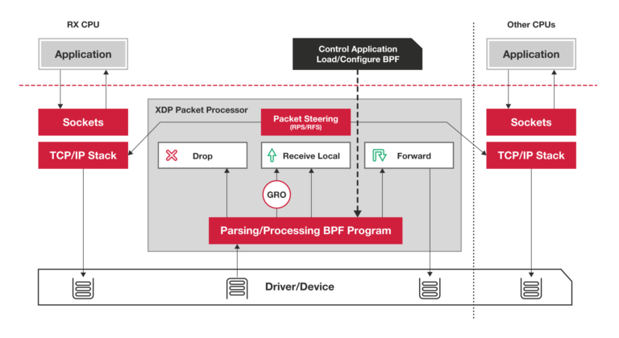

# EBPF 介绍-02
## eBPF 虚拟机
eBPF 是一个运行在内核中的虚拟机，很多人在初次接触它时，会把它跟系统虚拟化（比如 kvm）中的虚拟机弄混。其实，虽然都被称为“虚拟机”，系统虚拟化和 eBPF 虚拟机还是有着本质不同的。

系统虚拟化基于 x86 或 arm64 等通用指令集，这些指令集足以完成完整计算机的所有功能。而为了确保在内核中安全地执行，eBPF 只提供了非常有限的指令集。这些指令集可用于完成一部分内核的功能，但却远不足以模拟完整的计算机。为了更高效地与内核进行交互，eBPF 指令还有意采用了 C 调用约定，其提供的辅助函数可以在 C 语言中直接调用，极大地方便了 eBPF 程序的开发。

eBPF 在内核中的运行时主要由  5  个模块组成：
- 第一个模块是  eBPF 辅助函数。它提供了一系列用于 eBPF 程序与内核其他模块进行交互的函数。这些函数并不是任意一个 eBPF 程序都可以调用的，具体可用的函数集由 BPF 程序类型决定。
- 第二个模块是  eBPF 验证器。它用于确保 eBPF 程序的安全。验证器会将待执行的指令创建为一个有向无环图（DAG），确保程序中不包含不可达指令；接着再模拟指令的执行过程，确保不会执行无效指令。
- 第三个模块是由  11 个 64 位寄存器、一个程序计数器和一个 512 字节的栈组成的存储模块。这个模块用于控制 eBPF 程序的执行。其中，R0 寄存器用于存储函数调用和 eBPF 程序的返回值，这意味着函数调用最多只能有一个返回值；R1-R5 寄存器用于函数调用的参数，因此函数调用的参数最多不能超过 5 个；而 R10 则是一个只读寄存器，用于从栈中读取数据。
- 第四个模块是即时编译器，它将 eBPF 字节码编译成本地机器指令，以便更高效地在内核中执行。
- 第五个模块是  BPF 映射（map），它用于提供大块的存储。这些存储可被用户空间程序用来进行访问，进而控制 eBPF 程序的运行状态。
### ebpf helper function
eBPF 程序不能随意调用内核函数，只能调用在 API 中定义的辅助函数。这些辅助函数也被称为 eBPF helper 函数，它们是内核提供给 eBPF 程序的一组 API，用于完成一些常见的操作，比如访问内核数据结构、读写映射、分配内存、调试等等。eBPF helper 函数的定义在内核源码的 include/linux/bpf.h 文件中，可以在https://man7.org/linux/man-pages/index.html 查看所有的helper function。
``` shell
# bpftool feature probe
```
如果使用libbpf 进行开发, libbpf会基于内核的API中定义的辅助函数进行再次封装helpers 可以在这里看到 https://github.com/libbpf/libbpf/blob/master/src/bpf_helper_defs.h 
## BPF 类型格式 (BTF)
在安装 BCC 工具的时候，内核头文件 linux-headers-$(uname -r) 也是必须要安装的一个依赖项。这是因为 BCC 在编译 eBPF 程序时，需要从内核头文件中找到相应的内核数据结构定义。这样，你在调用 bpf_probe_read 时，才能从内存地址中提取到正确的数据类型。但是，编译时依赖内核头文件也会带来很多问题。主要有这三个方面：
- 首先，在开发 eBPF 程序时，为了获得内核数据结构的定义，就需要引入一大堆的内核头文件；
- 其次，内核头文件的路径和数据结构定义在不同内核版本中很可能不同。因此，你在升级内核版本时，就会遇到找不到头文件和数据结构定义错误的问题；
- 最后，在很多生产环境的机器中，出于安全考虑，并不允许安装内核头文件，这时就无法得到内核数据结构的定义。**在程序中重定义数据结构**虽然可以暂时解决这个问题，但也很容易把使用着错误数据结构的 eBPF 程序带入新版本内核中运行。
 
那么，这么多的问题该怎么解决呢？不用担心，BPF 类型格式（BPF Type Format, BTF）的诞生正是为了解决这些问题。从内核 5.2 开始，只要开启了 CONFIG_DEBUG_INFO_BTF，在编译内核时，内核数据结构的定义就会自动内嵌在内核二进制文件 vmlinux 中。并且，你还可以借助下面的命令，把这些数据结构的定义导出到一个头文件中（通常命名为 vmlinux.h）:
- 如果内核版本高于5.2, 可以使用如下命令生成btf文件
``` shell
bpftool btf dump file /sys/kernel/btf/vmlinux format c > vmlinux.h
```
- 如果内核版本低于5.2, 则默认是没有btf文件的, 可以从网络上下载

你在开发 eBPF 程序时只需要引入一个 vmlinux.h 即可，不用再引入一大堆的内核头文件了。
同时，借助 BTF、bpftool 等工具，我们也可以更好地了解 BPF 程序的内部信息，这也会让调试变得更加方便。比如，在查看 BPF 映射的内容时，你可以直接看到结构化的数据, 但是并非所有的map都会有btf信息, libbpf 宏定义包装出来的映射才会输出格式化的数据
``` shell
# git clone https://github.com/zjcbit/learning-ebpf/blob/main/chapter4/hello-ring-buffer-config.py
# cd chapter4
# python hello-ring-buffer-config.py
#bpftool prog list 
7460: kprobe  name hello  tag cbd8e84610183e77  gpl
	loaded_at 2023-07-20T09:38:49+0000  uid 0
	xlated 344B  jited 384B  memlock 4096B  map_ids 1025,1024
	btf_id 505
	pids python3(131326)
#bpftool map dump id 1025
[
  {
    "key": [
      "0x00",
      ...
    ],
    "value": [
      "0x48",
       ...
    ],
    "formatted": {
      "key": 0,
      "value": {
        "message": "Hey root!"
      }
    }
  }
]
```
解决了内核数据结构的定义问题，接下来的问题就是，如何让 eBPF 程序在内核升级之后，不需要重新编译就可以直接运行。eBPF 的一次编译到处执行（Compile Once Run Everywhere，简称 CO-RE）项目借助了 BTF 提供的调试信息，再通过下面的两个步骤，使得 eBPF 程序可以适配不同版本的内核：
- 第一，通过对 BPF 代码中的访问偏移量进行重写，解决了不同内核版本中数据结构偏移量不同的问题；
- 第二，在 libbpf 中预定义不同内核版本中的数据结构的修改，解决了不同内核中数据结构不兼容的问题。
## eBPF 程序可分类
eBPF 程序类型决定了一个 eBPF 程序可以挂载的事件类型和事件参数，这也就意味着，内核中不同事件会触发不同类型的 eBPF 程序。
根据内核头文件 [include/uapi/linux/bpf.h](https://elixir.bootlin.com/linux/v5.13/source/include/uapi/linux/bpf.h#L908) 中 bpf_prog_type 的定义，Linux 内核 v5.13 已经支持 30 种不同类型的 eBPF 程序（注意， BPF_PROG_TYPE_UNSPEC表示未定义）：
``` shell
enum bpf_prog_type {
  BPF_PROG_TYPE_UNSPEC, /* Reserve 0 as invalid program type */
  BPF_PROG_TYPE_SOCKET_FILTER,
  BPF_PROG_TYPE_KPROBE,
  BPF_PROG_TYPE_SCHED_CLS,
  BPF_PROG_TYPE_SCHED_ACT,
  BPF_PROG_TYPE_TRACEPOINT,
  BPF_PROG_TYPE_XDP,
  ... 
};
``` 
对于具体的内核来说，因为不同内核的版本和编译配置选项不同，一个内核并不会支持所有的程序类型。你可以在命令行中执行下面的命令，来查询当前系统支持的程序类型：
``` shell
#bpftool feature probe | grep program_type |grep "is available"
#bpftool feature probe | grep program_type
eBPF program_type socket_filter is available
eBPF program_type kprobe is available
eBPF program_type sched_cls is available
eBPF program_type sched_act is available
eBPF program_type tracepoint is available
... 
eBPF program_type lsm is NOT available
eBPF program_type sk_lookup is NOT available
eBPF program_type syscall is NOT available
```
在这些输出中，你可以看到当前内核支持 kprobe、tracepoint 等程序类型，而不支持 syscall、lsm 等程序类型。根据具体功能和应用场景的不同，这些程序类型大致可以划分为三类：
- 第一类是跟踪，即从内核和程序的运行状态中提取跟踪信息，来了解当前系统正在发生什么。
- 第二类是网络，即对网络数据包进行过滤和处理，以便了解和控制网络数据包的收发过程。
- 第三类是除跟踪和网络之外的其他类型，包括安全控制、BPF 扩展等等。
### 跟踪类 eBPF 
程序主要用于从系统中提取跟踪信息，进而为监控、排错、性能优化等提供数据支撑。
KPROBE、TRACEPOINT 以及 PERF_EVENT 都是最常用的 eBPF 程序类型，大量应用于监控跟踪、性能优化以及调试排错等场景中。我们前几讲中提到的 [BCC工具集](https://github.com/iovisor/bcc)，其中包含的绝大部分工具也都属于这个类型。
### 网络类 eBPF 程序
网络类 eBPF 程序主要用于对网络数据包进行过滤和处理，进而实现网络的观测、过滤、流量控制以及性能优化等各种丰富的功能。根据事件触发位置的不同，网络类 eBPF 程序又可以分为 XDP（eXpress Data Path，高速数据路径）程序、TC（Traffic Control，流量控制）程序、套接字程序以及 cgroup 程序，下面我们来分别看看。
#### XDP 程序
XDP 程序的类型定义为 BPF_PROG_TYPE_XDP，它在网络驱动程序刚刚收到数据包时触发执行。由于无需通过繁杂的内核网络协议栈，XDP 程序可用来实现高性能的网络处理方案，常用于 DDoS 防御、防火墙、4 层负载均衡等场景。你需要注意，XDP 程序并不是绕过了内核协议栈，它只是在内核协议栈之前处理数据包，而处理过的数据包还可以正常通过内核协议栈继续处理。你可以通过下面的图片加深对  XDP 相对内核协议栈位置的理解

根据网卡和网卡驱动是否原生支持 XDP 程序，XDP 运行模式可以分为下面这三种：
- 通用模式。它不需要网卡和网卡驱动的支持，XDP 程序像常规的网络协议栈一样运行在内核中，性能相对较差，一般用于测试；
- 原生模式。它需要网卡驱动程序的支持，XDP 程序在网卡驱动程序的早期路径运行；
- 卸载模式。它需要网卡固件支持 XDP 卸载，XDP 程序直接运行在网卡上，而不再需要消耗主机的 CPU 资源，具有最好的性能。
无论哪种模式，XDP 程序在处理过网络包之后，都需要根据 eBPF 程序执行结果，决定数据包的去处。这些执行结果对应以下 5 种 XDP 程序结果码：

通常来说，XDP 程序通过 ip link 命令加载到具体的网卡上，加载格式为：
``` shell
# eth1 为网卡名
# xdpgeneric 设置运行模式为通用模式
# xdp-example.o 为编译后的 XDP 字节码
sudo ip link set dev eth1 xdpgeneric object xdp-example.o
```
而卸载 XDP 程序也是通过 ip link 命令，具体参数如下：
``` shell
sudo ip link set veth1 xdpgeneric off
```
#### TC 程序
TC 程序的类型定义为 BPF_PROG_TYPE_SCHED_CLS 和 BPF_PROG_TYPE_SCHED_ACT，分别作为 [Linux 流量控制](https://tldp.org/HOWTO/Traffic-Control-HOWTO/index.html) 的分类器和执行器。Linux 流量控制通过网卡队列、排队规则、分类器、过滤器以及执行器等，实现了对网络流量的整形调度和带宽控制。
#### 套接字程序
套接字程序用于过滤、观测或重定向套接字网络包，具体的种类也比较丰富。根据类型的不同，套接字 eBPF 程序可以挂载到套接字（socket）、控制组（cgroup ）以及网络命名空间（netns）等各个位置。你可以根据具体的应用场景，选择一个或组合多个类型的 eBPF 程序，去控制套接字的网络包收发过程。
#### cgroup 程序
cgroup 程序用于对 cgroup 内所有进程的网络过滤、套接字选项以及转发等进行动态控制，它最典型的应用场景是对容器中运行的多个进程进行网络控制。
### 其他类 eBPF 程序
了上面的跟踪和网络 eBPF 程序之外，Linux 内核还支持很多其他的类型。这些类型的 eBPF 程序虽然不太常用，但在需要的时候也可以帮你解决很多特定的问题。


## 云原生于EBPF
每个服务器（无论是虚拟机还是裸机）都运行一个内核。当应用程序在容器中运行时，如果它们在同一台（虚拟）机器上运行，则它们共享相同的内核。在 Kubernetes 环境中，这意味着给定节点上所有 Pod 中的所有容器都使用相同的内核。当我们使用 eBPF 程序检测该内核时，该节点上的所有容器化工作负载对于这些 eBPF 程序都是可见的。节点上所有进程的可见性，再加上动态加载 eBPF 程序的能力，为我们提供了云原生计算中基于 eBPF 工具的真正超能力。

将ebpf与 sidecar 模型进行对比，sidecar 模型已用于将日志记录、跟踪、安全性和服务网格功能等功能添加到 Kubernetes 应用程序中。在 sidecar 方法中，服务作为容器运行，“注入”到每个应用程序 pod 中。此过程涉及修改定义应用程序 pod 的 YAML，添加 sidecar 容器的定义。这种方法虽然比将检测添加到应用程序的源代码中更方便，然而，sidecar 方法有一些缺点：
- 必须重新启动应用程序pod 才能添加sidecar。
- 必须修改应用程序YAML。这通常是一个自动化过程，但如果出现问题，则不会添加 sidecar，这意味着 pod 不会被检测。
- 当一个Pod内有多个容器时，它们可能在不同时间达到就绪状态，其顺序也不确定。注入 sidecar 可能会显着增加 Pod 的启动时间，或者，它可能会导致不稳定。例如，开放服务网格文档描述了应用程序容器如何能够适应所有被丢弃的流量，直到 Envoy 代理容器准备就绪。
- 当服务网格等网络功能作为 sidecar 实现时，这必然意味着进出应用程序容器的所有流量都必须通过内核中的网络堆栈到达网络代理容器，从而增加了该流量的延迟；
- 所有的pod都被注入相同的sidecar，这意味着sidecar的资源利用率可能不高。

由于基于 eBPF 的工具可以看到节点上发生的一切，因此上面的问题都可以解决。